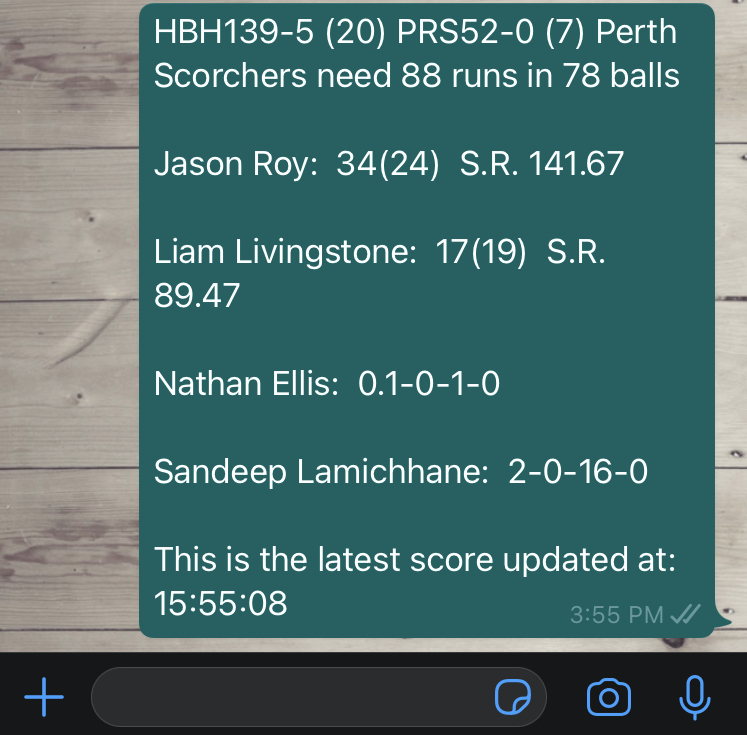

# Cricket Updates

### Why this tool?

Ever wanted the latest cricket scores periodically without repeatedly opening the browser or app? This tool eradicates the necessity for you to do all that and receive the scores as a WhatsApp message as well as in your Terminal.

### Installation

```
$ git clone https://github.com/<USER_NAME>/cricket_updates
$ cd cricket_updates/

* set up a virtual environment *

$ pip install -r requirements.txt
```

### Terminal Notification


### WhatsApp Notification


